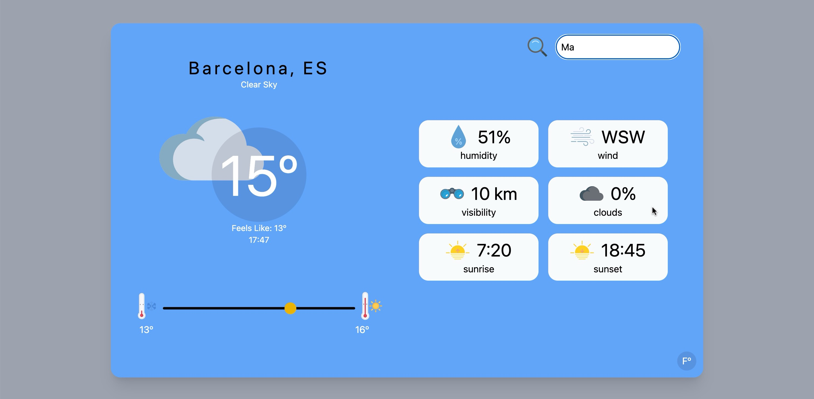
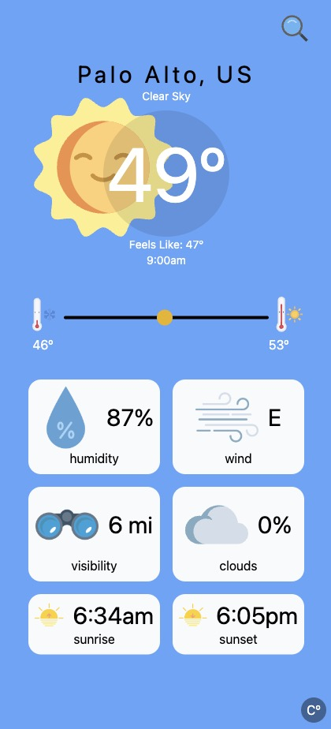

# weather app

This simple app allows users to search for the current temperature and weather conditions by searching for a city name.  If the selected city is not found, it will display a not found screen, or a loading screen while the information is retrieved.  Data is preselected to be viewed using the metric system, but can be converted to the imperial system with a click on the symbol in the bottom right corner.  The search bar slides away when not in use and can be slid out by clicking on the magnifying glass.  Hovering over any of the stat boxes will display a small animation of the icon. 

Deployed: http://weather-minezzig.vercel.app

## My process

### Built with

- HTML
- Tailwind CSS
- JavaScript 
- React
- Next.js
- [OpenWeather](https://openweathermap.org/) API

### What I learned

This app was a great way to continue practicing using tailwind as well as fetching information from an API.  I learned a few new tailwind classes such as group and group-hover.  This allows a child element to change when a user hovers over a parent element.  I also learned a lot about how to use Next.js including server/client side rendering, image tags, and favicons.  I really enjoyed working on the design aspect of this project. I feel like I'm really understanding how to look at a project from the beginning and plan out how HTML elements need to be laid out to later aid in the responsiveness of the app.

### Continued development

There are a couple of things that I'd like to work on further in this weather app.  The slider I have created shows the current high and low that can be found within the particular city and is not the high/low temp predicted for the day - as this is not available for the free API I used.  There is a version that provides a 5-day forecast with 3 hour increments, so the lows/highs could be calculated.  This is something I'm interested in pursuing.  I'm also interested in showing a 5 day forecast rather than the visibility, clouds, wind, and humidity.  Because, honestly, who cares about that information :)
